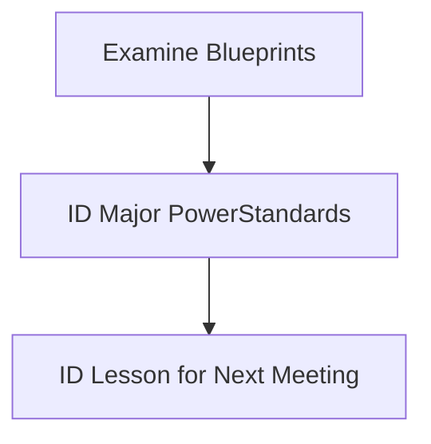

## Math Conclave One 

## 2026

# Introduction

Welcome to Math Conclave!

<!-- Slide 1 -->

---
layout: two-cols-header
---

Our Goals for this meeting:

::left::

<v-clicks> 
  
- Examine CAASPP Math Blueprints
- Determine Assessment Target prioroities
- Correlate Assessment Target Priorities to Standards
- Identify *power* standards
- Pick a power standard to focus on next time

</v-clicks>

::right::

---
class: scrollable
---

  <table class="fancy-table">
    <thead>
      <tr>
        <th>Claim</th>
        <th>Content Category</th>
        <th>Assessment Targets</th>
        <th>DOK</th>
        <th>CAT</th>
        <th>PT</th>
        <th>Total Items</th>
      </tr>
     </thead>
    <tbody>
      <tr>
        <td rowspan="16">Concepts and Procedures  **at least 4 CAT items at DOK 2 or higher</td>
        <td rowspan="11">Priority Cluster</td>
        <td>D. Interpret the stucture of expressions</td>
        <td>1,2</td>
        <td rowspan="2">1-2</td>
        <td rowspan="16">0</td>
        <td rowspan="16">11</td>
      </tr>
      <tr>
        <td>E. Write expresssions in equivalent forms to solve problems.</td>
        <td>1,2</td>
      </tr>
      <tr>
        <td>F. Perform arithemetic operations on polynomials.</td>
        <td>2</td>
        <td>0-1</td>
      </tr>
      <tr>
        <td>G. Create equations that describe numbers or relationships</td>
        <td>1,2</td>
        <td rowspan="3">2</td>
      </tr>
      <tr>
        <td>H. Understand solving equations as a process of reasoning and explain the reasoning</td>
        <td>1,2</td>
      </tr>
      <tr>
        <td>I. Solve equations and inequalities in one variable.</td>
        <td>1,2></td>
      </tr>
      <tr>
        <td>J. Represent and solve equations and einequalities graphically</td>
        <td>1,2></td>
        <td>0-2</td>
      </tr>
      <tr>
        <td>K. Understand the concept of a function and use function notation</td>
        <td>1,2></td>
        <td>0-2</td>
      </tr>
      <tr>
        <td>L. Interpret functions that arise in applications in terms of a context</td>
        <td>1,2</td>
        <td rowspan="3">2</td>
      </tr>
      <tr>
        <td>M. Analyze functions using different representations</td>
        <td>1,2,3</td>
      </tr>
      <tr>
        <td>N. Build a function that models a relationship between two quantities.</td>
        <td>2</td>
      </tr>
      <tr>
        <td rowspan="5">Supporting Cluster</td>
        <td>O. Define trigonometric ratios and solve problems involving right triangles</td>
        <td>1,2</td>
        <td>0-2</td>
      </tr>
      <tr>
        <td>P. Summarize represent, and interpret date on a single count or measurement variable.</td>
        <td>2</td>
        <td>0-2</td>
      </tr>
      <tr>
        <td>A. Extend the properties of exponents to rational exponents.</td>
        <td>1,2</td>
        <td rowspan="2">0-1</td>
      </tr> 
      <tr>
        <td>B. Use properties of rational and irrational numbers</td>
        <td>1,2</td>
      </tr>
      <tr>
        <td>C. Reason quantitatively and use units to solve problems.</td>
        <td>1,2</td>
        <td>0-1</td>
      </tr>
      <tr>
        <td rowspan="6">2. Problem Solving   4. Modeling and Data Analysis **at least 1 CAT item at DOK3 or higher (combined 2&4)</td>
        <td rowspan="2">Problem Solving (drawn across content domains)</td>
        <td>A. Apply mathematics to solve well-posed problems arising in everyday life, society, and the workplace.</td>
        <td>2, 3</td>
        <td>0-1</td>
        <td rowspan="2">1–2</td>
        <td rowspan="6">5–7</td>
      </tr>
      <tr>
        <td>B. Select and use appropriate tools strategically. C. Interpret results in the context of a situation. D. Identify important quantities in a practical situation and map their relationships (e.g., using diagrams, two-way tables, graphs, flow charts, or formulas).</td>
        <td>1, 2, 3</td>
        <td>0-1</td>
      </tr>
      <tr>
        <td rowspan="4">Modeling and Data Analysis (drawn across content domains)</td>
        <td>A. Apply mathematics to solve problems arising in everyday life, society, and the workplace. D. Interpret results in the context of a situation.</td>
        <td>2, 3</td>
        <td>0-1</td>
        <td rowspan="4">1–3</td>
      </tr>
      <tr>
        <td>B. Construct, autonomously, chains of reasoning to justify mathematical models used, interpretations made, and solutions proposed for a complex problem. E. Analyze the adequacy of and make improvements to an existing model or develop a mathematical model of a real phenomenon.</td>
        <td>2, 3, 4</td>
        <td>0-1</td>
      </tr>
      <tr>
        <td>C. State logical assumptions being used. F. Identify important quantities in a practical situation and map their relationships (e.g., using diagrams, two-way tables, graphs, flow charts, or formulas).</td>
        <td>1, 2, 3 </td>
        <td>0-1</td>
      </tr>
      <tr>
        <td>G. Identify, analyze, and synthesize relevant external resources to pose or solve problems.</td>
        <td>3,4</td>
        <td>0</td>
      </tr>
      <tr>
        <td rowspan="3">3. Communicating Reasoning **at least 1 CAT item at DOK 3 or higher)</td>
        <td rowspan="3">Communicating Reasoning (drawn across content domains)</td>
        <td>A. Test propositions or conjectures with specific examples. D. Use the technique of breaking an argument into cases.</td>
        <td>2, 3</td>
        <td>1-2</td>
        <td rowspan="3">0-2</td>
        <td rowspan="3">4-6</td>
      </tr>
      <tr>
        <td>B. Construct, autonomously, chains of reasoning that will justify or refute propositions or conjectures. E. Distinguish correct logic or reasoning from that which is flawed, and—if there is a flaw in the argument—explain what it is.</td>
        <td>2, 3, 4</td>
        <td>1-2</td>
      </tr>
      <tr>
        <td>C. State logical assumptions being used. F. Base arguments on concrete referents such as objects, drawings, diagrams, and actions. G. At later grades, determine conditions under which an argument does and does not apply. (For example, area increases with perimeter for squares, but not for all plane figures.)</td>
        <td>2, 3</td>
        <td>1</td>
      </tr>
    </tbody>
  </table>
  

---
layout: image-right
image: /ma1.jpg
---

## Math Reasoning?

Which Assessment Targets are MOST used? What DOK level do they fall on? Should we graph this?

---
class: scrollable fancy-table
---
# Concepts and Procedures

|Target|0-1|0-2|1|1-2|1-3|2|DOK|
|---|:---:|:---:|:---:|:---:|:---:|:---:|:---:|
|1A. Extend the properties of exponents to rational exponents.|1||||||2|
|1B. Use properties of rational and irrational numbers.|1||||||2|
|1C. Reason quantitatively and use units to solve problems|1||||||2|
|1D. Interpret the structure of expressions.||||1|||2|
|1E. Write expressions in equivalent forms to solve problems.||||1|||2|
|1F. Perform arithmetic operations on polynomials.|1||||||2|
|1G. Create equations that describe numbers or relationships.||||||1|2|
|1H. Understand solving equations as a process of reasoning and explain the reasoning.||||||1|2|
|1I. Solve equations and inequalities in one variable.||||||1|2|
|1J. Represent and solve equations and inequalities graphically.||1|||||2|
|1K. Understand the concept of a function and use function notation.||1|||||2|
|1L. Interpret functions that arise in applications in terms of a context.||||||1|2|
|1M. Analyze functions using different representations.||||||1|3|
|1N. Build a function that models a relationship between two quantities.||||||1|2|
|1O. Define trigonometric ratios and solve problems involving right triangles.||1|||||2|
|1P. Summarize, represent, and interpret data on a single count or measurement variable.||1|||||2|

---
class: fancy-table
---

# 2. Problem Solving

|Target|0-1|0-2|1|1-2|1-3|2|DOK|
|---|:---:|:---:|:---:|:---:|:---:|:---:|:---:|
|2A. Apply mathematics to solve well-posed problems arising in everyday life, society, and the||1||||||1||||||3|
|2B. Select and use appropriate tools strategically.||1||||||1||||||3|
|2C. Interpret results in the context of a situation.||1||||||1||||||3|
|2D. Identify important quantities in a practical situation and map their relationships (e.g., using diagrams, two-way tables, graphs, flow charts, or formulas).||1||||||1||||||3|

---
class: scrollable fancy-table
---

# 4. Moldeling and Data Analysis

|Target|0-1|0-2|1|1-2|1-3|2|DOK|
|---|:---:|:---:|:---:|:---:|:---:|:---:|:---:|
|4A. Apply mathematics to solve problems arising in everyday life, society, and the workplace.||1||||||||1||||3|
|4D. Interpret results in the context of a situation.||1||||||||1||||3|
|4B. Construct, autonomously, chains of reasoning to justify mathematical models used, interpretations||1||||||||1||||4|
|made, and solutions proposed for a complex problem. made, and solutions proposed for a complex problem.||1||||||||1||||4|
|4E. Analyze the adequacy of and make improvements to an existing model or develop a mathematical model of a real phenomenon. model of a real phenomenon.||1||||||||1||||4|
|4C. State logical assumptions being used.||1||||||||1||||3|
|4F. Identify important quantities in a practical situation and map their relationships (e.g., using diagrams, two-way tables, graphs, flow charts, or formulas).||1||||||||1||||3|
|4G. Identify, analyze, and synthesize relevant external resources to pose or solve problems. 3, 4 0||||||||||1||||4|

---
class: scrollable fancy-table
---

# 3. Communicating Reasoning

|Target|0-1|0-2|1|1-2|1-3|2|DOK|
|---|:---:|:---:|:---:|:---:|:---:|:---:|:---:|
|3A. Test propositions or conjectures with specific examples.||||1||||1||||||3|
|3D. Use the technique of breaking an argument into cases.||||1||||1||||||3|
|3B. Construct, autonomously, chains of reasoning that will justify or refute propositions or conjectures.||||1||||1||||||4|
|3E. Distinguish correct logic or reasoning from that which is flawed, and—if there is a flaw in the argument—explain what it is.||||1||||1||||||4|
|3C. State logical assumptions being used.||||1||1||||||||3|
|3F. Base arguments on concrete referents such as objects, drawings, diagrams, and actions.||||1||1||||||||3|
|3G. At later grades, determine conditions under which an argument does and does not apply. (For example, area increases with perimeter for squares, but not for all plane figures.)||||1||1||||||||3|

---
layout: image-right
image: /2A1a.jpg
backgroundSize: 30em 50%
---

# Full Statement
A company that makes rectangular baking pans labels each pan with the dimensions, in inches, and the capacity in quarts. A company employee needs to label a rectangular pan with dimensions 7 inches by 11 inches by 2 inches.

A pan is shown with a length of 11 inches, a width of 7 inches and a height of 2 inches.

1 quart = 57.75 cubic inches

What is the capacity, in quarts, of this pan? Round your answer to the nearest tenth.

# Rubric
(1 point) The student correctly determines that the capacity in quarts of the pan (e.g., accept 2.66 – 2.7).

<!-- 2A.1a -->

---

# Full Statement
The $1000 prize for a lottery is to be divided evenly among the winners. Initially, there are x winners.
However, one more winner comes forward, causing each winner to receive $50 less.

Enter an equation that represents the situation and can be used to solve for x, the initial number of winners.
Enter your equation in the response box.

# Rubric
(1 point) The student creates a correct equation (e.g., 
$\frac {1000} {x}-50=\frac {1000} {z+1}$ )

<!-- 2A.2a -->

---

# Full Statement
A restaurant serves a vegetarian and a chicken lunch special each day. Each vegetarian special is the same price.

Each chicken special is the same price. However, the price of the vegetarian special is different from the price of the chicken special.

On Thursday, the restaurant collected $467 selling 21 vegetarian specials and 40 chicken specials.
On Friday, the restaurant collected $484 selling 28 vegetarian specials and 36 chicken specials.
Enter the cost, in dollars, of the vegetarian lunch special.

# Rubric
(1 point) The student correctly determines the cost of the vegetarian special (7).

<!-- 2A.3a -->
---

# Full Statement
Susan has an ear infection. Her doctor prescribes an antibiotic. The doctor tells Susan to take a 250-milligram dose of the antibiotic every 12 hours for the next 10 days.
- Susan finds out that 4% of the antibiotic is still in her body after 12 hours.
- Assume that each dose is exactly 250 milligrams and that Susan takes one dose every 12 hours.
  - *Part A:* How much of the antibiotic, in milligrams, is in Susan’s body immediately after taking the 2nd dose? Enter your answer in the first response box.
  - *Part B:* How much of the antibiotic, in milligrams, is in Susan’s body immediately after taking the 10th dose? Enter your answer in the second response box.
# Rubric
(2 points) The student enters the correct amount of antibiotic in Susan’s body for Part A and B (e.g., 260, 260.4167). Note: An acceptable range for Part B is 260.4-260.422. (1 point) The student enters the correct amount for Part A or Part B, but not both.

<!-- 2A.4a -->
---
layout: two-cols
---

# Full Statement
Two water tanks are shown. Tank A is a rectangular prism and Tank B is a cylinder. The tanks are not drawn to scale.

- Tank A is filled with water to the 10-meter mark.

- Half of the water from Tank A is poured into Tank B. The water level on Tank A drops to 5 meters and the water level on Tank B becomes 4 meters.

Find the radius of Tank B, rounded to the nearest meter. Enter Your answer in the response box.

# Rubric
(1 point). The student enters the correct radius in the response box (5).

::Right::

 

<!-- 2A.5a -->
---

# Full Statement
A circle with center (6, 7) includes the point (1, 4). A second circle also include the point (1, 4), and contains the same area but has a different center.

Enter the ordered pair that corresponds to the center of the second circle.

(  ,  )

# Rubric
(1 point) The student correctly enters the ordered pair in the response box [(−4, 1)].

<!-- 2A.6a -->
---
layout: end
---

