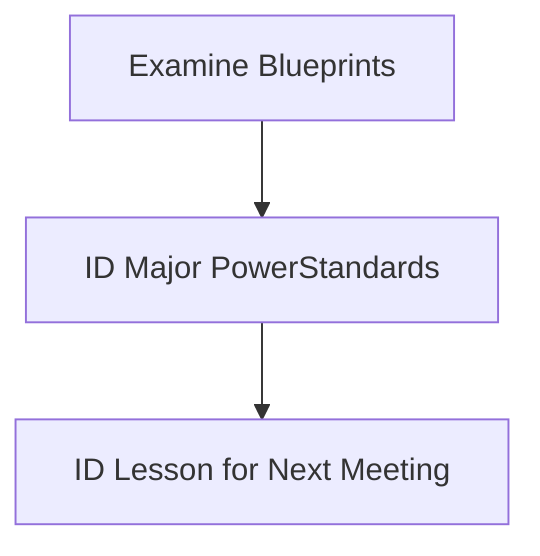

## Math Conclave One 
## 2026

# Introduction

Welcome to Math Conclave!

<!-- Slide 1 -->

---
layout: two-cols-header
---

Our Goals for this meeting:

::left::

<v-clicks> 
  
- Examine CAASPP Math Blueprints
- Determine Assessment Target prioroities
- Correlate Assessment Target Priorities to Standards
- Identify *power* standards
- Pick a power standard to focus on next time

(/v-click>

::right::

---
class: scroll-box
---

  <table class="fancy-table">
    <thead>
      <tr>
        <th>Claim</th>
        <th>Content Category</th>
        <th>Assessment Targets</th>
        <th>DOK</th>
            <th>CAT</th>
            <th>PT</th>
        <th>Total Items</th>
      </tr>
    </thead>
    <tbody>
      <tr>
        <td rowspan="16">Concepts and Procedures</td>
        <td rowspan="11">Priority Cluster</td>
        <td>D. Interpret the stucture of expressions</td>
        <td>1,2</td>
        <td rowspan="2"> 1-2</td>
        <td rowspan="16">0</td>
        <td rowspan="16">11</td>
      <tr>
        <td>E. Write expresssions in equivalent forms to solve problems.</td>
        <td>1,2</td>
      </tr>
      <tr>
        <td>F. Perform arithemetic operations on polynomials.</td>
        <td>2</td>
        <td>0-1</td>
      </tr>
        <td>G. Create equations that describe numbers or relationships</td>
        <td>1,2</td>
        <td rowspan="3">2</td>
      </tr>
      <tr>
        <td>H. Understand solving equations as a process of reasoning and explain the reasoning</td>
        <td>1,2</td>
      </tr>
      <tr>
        <td>I. Solve equations and inequalities in one variable.</td>
        <td>1,2></td>
      </tr>
      <tr>
        <td>J. Represent and solve equations and einequalities graphically</td>
        <td>1,2></td>
        <td>0-2</td>
      </tr>
      <tr>
        <td>K. Understand the concept of a function and use function notation</td>
        <td>1,2></td>
        <td>0-2</td>
      </tr>
      <tr>
        <td>L. Interpret functions that arise in applications in terms of a context</td>
        <td>1,2</td>
        <td rowspan="3">2</td>
      </tr>
      <tr>
        <td>M. Analyze functions using different representations</td>
        <td>1,2,3</td>
      </tr>
      <tr>
        <td>N. Build a function that models a relationship between two quantities.</td>
        <td>2</td>
      </tr>
      <tr>
        <td rowspan="5">Supporting Cluster</td>
        <td>O. Define trigonometric ratios and solve problems involving right triangles</td>
        <td>1,2</td>
        <td>0-2</td>
      </tr>
      <tr>
        <td>P. Summarize represent, and interpret date on a single count or measurement variable.</td>
        <td>2</td>
        <td>0-2</td>
      </tr>
      <tr>
        <td>A. Extend the properties of exponents to rational exponents.</td>
        <td>1,2</td>
        <td rowspan="2">0-1</td>
      </tr> 
      <tr>
        <td>B. Use properties of rational and irrational numbers</td>
        <td>1,2</td>
      </tr>
      <tr>
        <td>C. Reason quantitatively and use units to solve problems.</td>
        <td>1,2</td>
        <td>0-1</td>
      </tr>
      <tr>
        <td rowspan="7">2. Problem Solving 4. Modeling & Data Analysis</td>
        <td rowspan="4">Problem Solving (drawn across content domains)</td>
        <td>A. Apply mathematics to solve well-posed problems arising in everyday life, society, and the workplace.</td>
        <td>2, 3</td>
        <td>0–1</td>
        <td>1–2</td>
        <td>5–7</td>
      </tr>
      <tr>
        <td>B. Select and use appropriate tools strategically.</td>
        <td>1, 2, 3</td>
        <td>0–1</td>
        <td></td>
        <td></td>
      </tr>
      <tr>
        <td>C. Interpret results in the context of a situation.</td>
        <td>1, 2, 3</td>
        <td>0–1</td>
        <td></td>
        <td></td>
      </tr>
      <tr>
        <td>D. Identify important quantities and map their relationships (e.g., diagrams, tables, graphs, flow charts, formulas).</td>
        <td>1, 2, 3</td>
        <td>0–1</td>
        <td></td>
        <td></td>
      </tr>
  
      <tr>
        <td rowspan="3">Modeling & Data Analysis (drawn across content domains)</td>
        <td>A. Apply mathematics to solve problems arising in everyday life, society, and the workplace. D. Interpret results in the context of a situation.</td>
        <td>2, 3</td>
        <td>0–1</td>
        <td>1–3</td>
        <td></td>
      </tr>
      <tr>
        <td>B. Construct chains of reasoning to justify models; E. Analyze and improve existing models.</td>
        <td>2, 3, 4</td>
        <td>0–1</td>
        <td></td>
        <td></td>
      </tr>
      <tr>
        <td>C. State logical assumptions; F. Identify important quantities and map relationships; G. Synthesize external resources.</td>
        <td>1, 2, 3 (G = 3, 4)</td>
        <td>0–1 (G = 0)</td>
        <td></td>
        <td></td>
      </tr>
  
      <!-- Claim 3 -->
      <tr>
        <td rowspan="4">3. Communicating Reasoning</td>
        <td rowspan="4">Communicating Reasoning (drawn across content domains)</td>
        <td>A. Test propositions or conjectures with examples. D. Use case-based arguments.</td>
        <td>2, 3</td>
        <td>1–2</td>
        <td>0–2</td>
        <td>4–6</td>
      </tr>
      <tr>
        <td>B. Construct chains of reasoning to justify or refute propositions. E. Identify flawed reasoning and explain the flaw.</td>
        <td>2, 3, 4</td>
        <td>1–2</td>
        <td></td>
        <td></td>
      </tr>
      <tr>
        <td>C. State logical assumptions being used.</td>
        <td>2, 3</td>
        <td>1</td>
        <td></td>
        <td></td>
      </tr>
      <tr>
        <td>F. Base arguments on concrete referents. G. Determine when an argument applies (later grades).</td>
        <td>2, 3</td>
        <td>1</td>
        <td></td>
        <td></td>
      </tr>
    </tbody>
  </tabel>
  
---
layout: end
---

