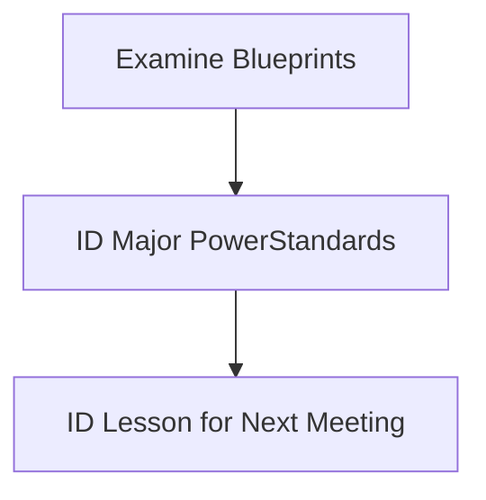

## Math Conclave One 

## 2026

# Introduction

Welcome to Math Conclave!

<!-- Slide 1 -->

---
layout: two-cols-header
---

Our Goals for this meeting:

::left::

<v-clicks> 
  
- Examine CAASPP Math Blueprints
- Determine Assessment Target prioroities
- Correlate Assessment Target Priorities to Standards
- Identify *power* standards
- Pick a power standard to focus on next time

</v-clicks>

::right::

---
class: scrollable
---

  <table class="fancy-table">
    <thead>
      <tr>
        <th>Claim</th>
        <th>Content Category</th>
        <th>Assessment Targets</th>
        <th>DOK</th>
        <th>CAT</th>
        <th>PT</th>
        <th>Total Items</th>
      </tr>
     </thead>
    <tbody>
      <tr>
        <td rowspan="16">Concepts and Procedures  **at least 4 CAT items at DOK 2 or higher</td>
        <td rowspan="11">Priority Cluster</td>
        <td>D. Interpret the stucture of expressions</td>
        <td>1,2</td>
        <td rowspan="2">1-2</td>
        <td rowspan="16">0</td>
        <td rowspan="16">11</td>
      </tr>
      <tr>
        <td>E. Write expresssions in equivalent forms to solve problems.</td>
        <td>1,2</td>
      </tr>
      <tr>
        <td>F. Perform arithemetic operations on polynomials.</td>
        <td>2</td>
        <td>0-1</td>
      </tr>
      <tr>
        <td>G. Create equations that describe numbers or relationships</td>
        <td>1,2</td>
        <td rowspan="3">2</td>
      </tr>
      <tr>
        <td>H. Understand solving equations as a process of reasoning and explain the reasoning</td>
        <td>1,2</td>
      </tr>
      <tr>
        <td>I. Solve equations and inequalities in one variable.</td>
        <td>1,2></td>
      </tr>
      <tr>
        <td>J. Represent and solve equations and einequalities graphically</td>
        <td>1,2></td>
        <td>0-2</td>
      </tr>
      <tr>
        <td>K. Understand the concept of a function and use function notation</td>
        <td>1,2></td>
        <td>0-2</td>
      </tr>
      <tr>
        <td>L. Interpret functions that arise in applications in terms of a context</td>
        <td>1,2</td>
        <td rowspan="3">2</td>
      </tr>
      <tr>
        <td>M. Analyze functions using different representations</td>
        <td>1,2,3</td>
      </tr>
      <tr>
        <td>N. Build a function that models a relationship between two quantities.</td>
        <td>2</td>
      </tr>
      <tr>
        <td rowspan="5">Supporting Cluster</td>
        <td>O. Define trigonometric ratios and solve problems involving right triangles</td>
        <td>1,2</td>
        <td>0-2</td>
      </tr>
      <tr>
        <td>P. Summarize represent, and interpret date on a single count or measurement variable.</td>
        <td>2</td>
        <td>0-2</td>
      </tr>
      <tr>
        <td>A. Extend the properties of exponents to rational exponents.</td>
        <td>1,2</td>
        <td rowspan="2">0-1</td>
      </tr> 
      <tr>
        <td>B. Use properties of rational and irrational numbers</td>
        <td>1,2</td>
      </tr>
      <tr>
        <td>C. Reason quantitatively and use units to solve problems.</td>
        <td>1,2</td>
        <td>0-1</td>
      </tr>
      <tr>
        <td rowspan="6">2. Problem Solving   4. Modeling and Data Analysis **at least 1 CAT item at DOK3 or higher (combined 2&4)</td>
        <td rowspan="2">Problem Solving (drawn across content domains)</td>
        <td>A. Apply mathematics to solve well-posed problems arising in everyday life, society, and the workplace.</td>
        <td>2, 3</td>
        <td>0-1</td>
        <td rowspan="2">1–2</td>
        <td rowspan="6">5–7</td>
      </tr>
      <tr>
        <td>B. Select and use appropriate tools strategically. C. Interpret results in the context of a situation. D. Identify important quantities in a practical situation and map their relationships (e.g., using diagrams, two-way tables, graphs, flow charts, or formulas).</td>
        <td>1, 2, 3</td>
        <td>0-1</td>
      </tr>
      <tr>
        <td rowspan="4">Modeling and Data Analysis (drawn across content domains)</td>
        <td>A. Apply mathematics to solve problems arising in everyday life, society, and the workplace. D. Interpret results in the context of a situation.</td>
        <td>2, 3</td>
        <td>0-1</td>
        <td rowspan="4">1–3</td>
      </tr>
      <tr>
        <td>B. Construct, autonomously, chains of reasoning to justify mathematical models used, interpretations made, and solutions proposed for a complex problem. E. Analyze the adequacy of and make improvements to an existing model or develop a mathematical model of a real phenomenon.</td>
        <td>2, 3, 4</td>
        <td>0-1</td>
      </tr>
      <tr>
        <td>C. State logical assumptions being used. F. Identify important quantities in a practical situation and map their relationships (e.g., using diagrams, two-way tables, graphs, flow charts, or formulas).</td>
        <td>1, 2, 3 </td>
        <td>0-1</td>
      </tr>
      <tr>
        <td>G. Identify, analyze, and synthesize relevant external resources to pose or solve problems.</td>
        <td>3,4</td>
        <td>0</td>
      </tr>
      <tr>
        <td rowspan="3">3. Communicating Reasoning **at least 1 CAT item at DOK 3 or higher)</td>
        <td rowspan="3">Communicating Reasoning (drawn across content domains)</td>
        <td>A. Test propositions or conjectures with specific examples. D. Use the technique of breaking an argument into cases.</td>
        <td>2, 3</td>
        <td>1-2</td>
        <td rowspan="3">0-2</td>
        <td rowspan="3">4-6</td>
      </tr>
      <tr>
        <td>B. Construct, autonomously, chains of reasoning that will justify or refute propositions or conjectures. E. Distinguish correct logic or reasoning from that which is flawed, and—if there is a flaw in the argument—explain what it is.</td>
        <td>2, 3, 4</td>
        <td>1-2</td>
      </tr>
      <tr>
        <td>C. State logical assumptions being used. F. Base arguments on concrete referents such as objects, drawings, diagrams, and actions. G. At later grades, determine conditions under which an argument does and does not apply. (For example, area increases with perimeter for squares, but not for all plane figures.)</td>
        <td>2, 3</td>
        <td>1</td>
      </tr>
    </tbody>
  </table>
  

---
layout: image-right
image: /image.png
---

## Math Reasoning?

Which Assessment Targets are MOST used? What DOK level do they fall on? Should we graph this?

---
class: scrollable fancy-table
---
# Concepts and Procedures

|Target|0-1|0-2|1|1-2|1-3|2|DOK|
|---|:---|:---|:---|:---|:---|:---|:---|
|1A. Extend the properties of exponents to rational exponents.|1||||||2|
|1B. Use properties of rational and irrational numbers.|1||||||2|
|1C. Reason quantitatively and use units to solve problems|1||||||2|
|1D. Interpret the structure of expressions.||||1|||2|
|1E. Write expressions in equivalent forms to solve problems.||||1|||2|
|1F. Perform arithmetic operations on polynomials.|1||||||2|
|1G. Create equations that describe numbers or relationships.||||||1|2|
|1H. Understand solving equations as a process of reasoning and explain the reasoning.||||||1|2|
|1I. Solve equations and inequalities in one variable.||||||1|2|
|1J. Represent and solve equations and inequalities graphically.||1|||||2|
|1K. Understand the concept of a function and use function notation.||1|||||2|
|1L. Interpret functions that arise in applications in terms of a context.||||||1|2|
|1M. Analyze functions using different representations.||||||1|3|
|1N. Build a function that models a relationship between two quantities.||||||1|2|
|1O. Define trigonometric ratios and solve problems involving right triangles.||1|||||2|
|1P. Summarize, represent, and interpret data on a single count or measurement variable.||1|||||2|

---
layout: end
---

