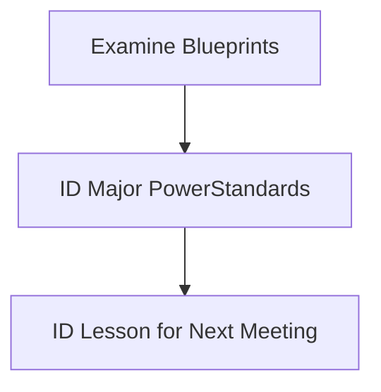

## Math Conclave One 
## 2026

# Introduction

Welcome to Math Conclave!

<!-- Slide 1 -->

---
layout: two-cols-header
---

Our Goals for this meeting:

::left::

<v-clicks> 
  
- Examine CAASPP Math Blueprints
- Determine Assessment Target prioroities
- Correlate Assessment Target Priorities to Standards
- Identify *power* standards
- Pick a power standard to focus on next time

(/v-click>

::right::

---
class: scroll-box
---

  <table class="fancy-table">
    <thead>
      <tr>
        <th>claim</th>
        <th>Content Category</th>
        <th>Assessment Targets</th>
        <th>DOK</th>
            <th>CAT</th>
            <th>PT</th>
        <th>Total Items</th>
      </tr>
    </thead>
    <tbody>
      <tr>
        <td rowspan="4">Concepts and Procedures</td>
        <td rowspan="4">Priority Cluster</td>
        <td>D. Interpret the stucture of expressions</td>
        <td>1,2</td>
        <td rowspan="2"> 1-2</td>
        <td rowspan="4">0</td>
        <td rowspan="4">11</td>
      <tr>
        <td>E. Write expresssions in equivalent forms to solve problems.</td>
        <td>1,2</td>
      </tr>
      <tr>
        <td>F. Perform arithemetic operations on polynomials.</td>
        <td>2</td>
        <td>0-1</td>
      </tr>
        <td>G. Create equations that describe numbers or relationships</td>
        <td>1,2</td>
        <td>2</td>
    </tbody>
  
  
---
layout: end
---

